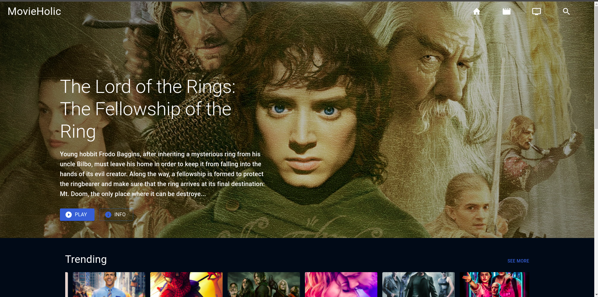
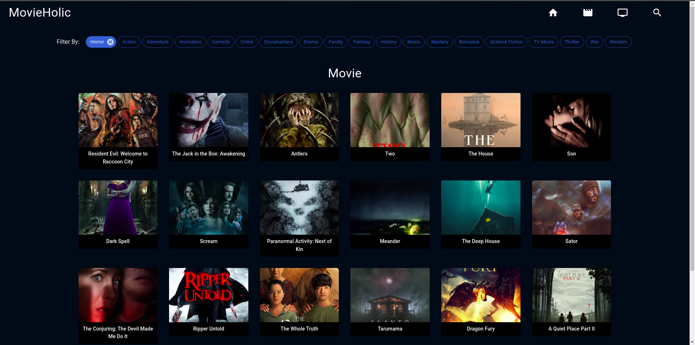
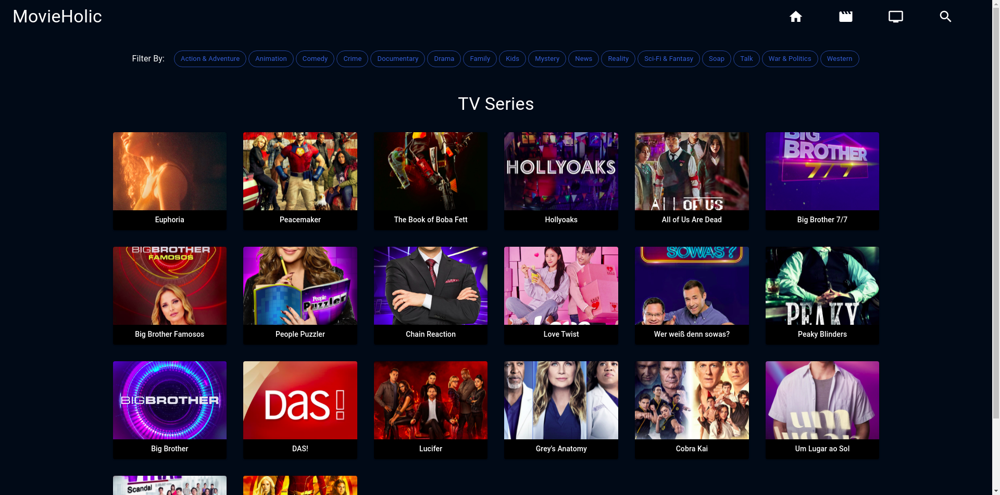
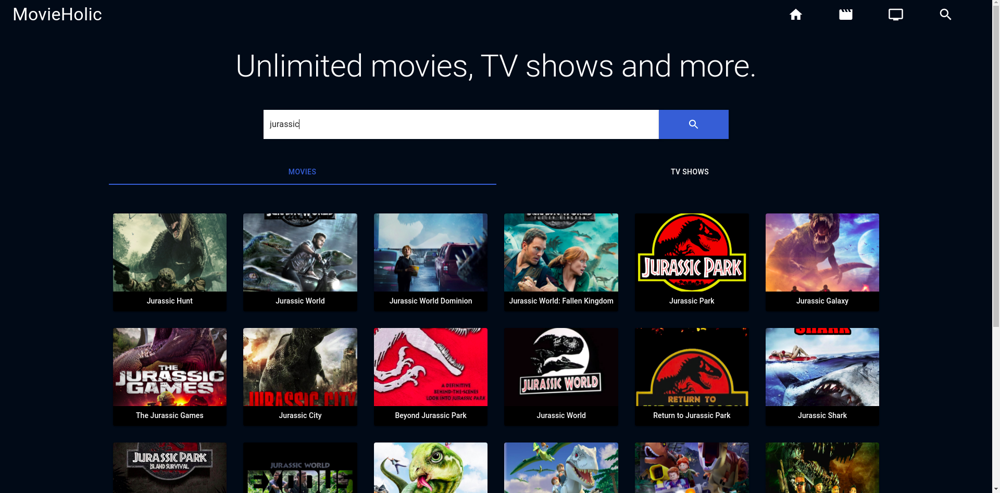
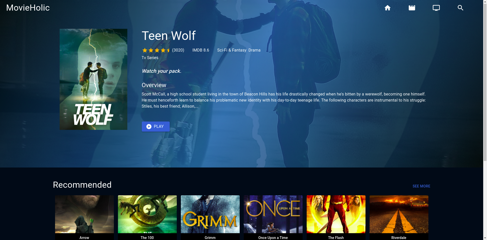

<h1>MovieHolic : React Movie and Web Series App<h1>
  
 <h3>Description<h3>
  React MovieHolic app created by using Material UI and TMDB Api.  
   
 <h3>Website<h3>
https://movie-holic.netlify.app/ 

<h3>Screenshots</h3>
 
 
 
 
 
 

<h3> Setup<h3>
   run npm i && npm start 
